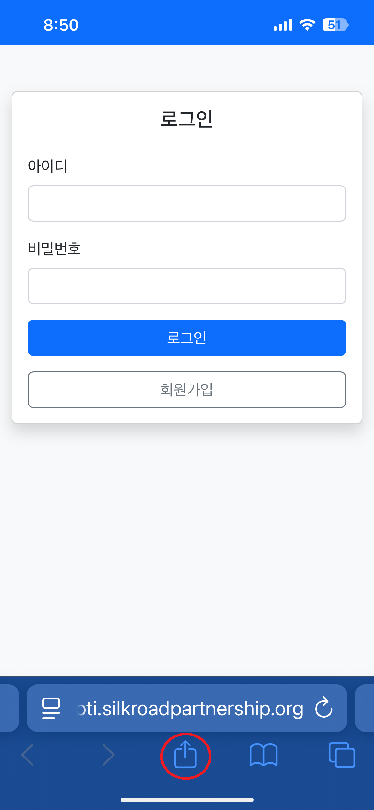
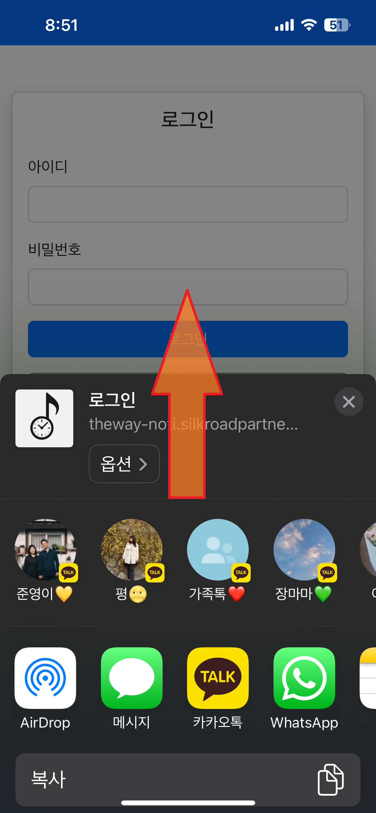
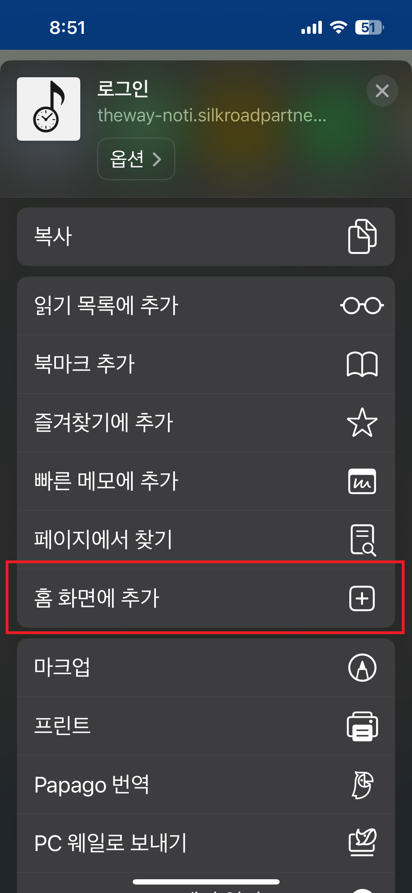
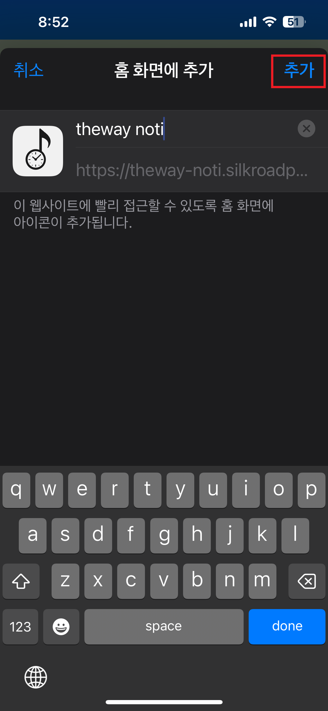
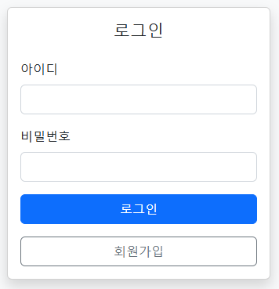
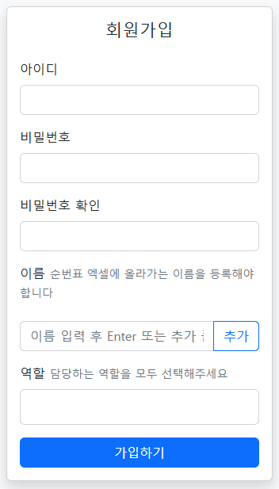
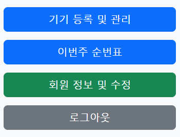
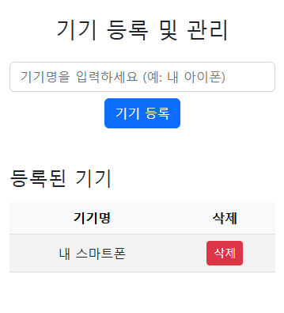

# 더웨이 순번 알림 푸시

[사이트 접속 링크](https://theway-noti.silkroadpartnership.org)

## 기기등록 가이드

### 0. 아이폰 홈화면 추가하기

아이폰은 회원가입전 페이지 화면을 홈화면에 북마크를 추가(PWA)해야 알림이 정상동작 합니다.  
아래의 설명을 따라 진행하여 홈화면에 북마크를 추가해주시기 바랍니다.

1. 공유하기 버튼 클릭  
  화면에 접속하여 아래의 공유하기 버튼을 클릭합니다.  
  기기에 따라 공유하기 버튼의 위치가 다를 수 있습니다.
    

2. 홈화면에 추가하기 클릭  
  공유하기 버튼 클릭시 뜨는 팝업을 위로 스크롤하여  
  "홈화면에 추가"를 찾아 클릭합니다.
    
    

3. 홈화면에 추가하기  
  "홈화면에 추가"클릭시 발생한 팝업에서  
  우상단의 추가하기 버튼을 클릭하면  
  화면에 어플처럼 설치되는 북마크를 확인할 수 있습니다.  
  아래의 절차는 해당 북마크로 접속하여 진행해주셔야 정상적으로 동작합니다.
    
    

   

### 1. 회원 가입

아래의 회원가입 버튼을 눌러 회원가입 화면으로 들어갑니다
   

회원가입에 다음과 같은 정보를 입력하고 가입하기 버튼을 클릭하여 가입합니다
- 로그인시 사용할 아이디와 비밀번호
- 비밀번호의 입력값을 확인하기 위한 비밀번호 확인
- 순번표 엑셀에서 사용자를 확인하기 위한 이름  
  - 현재 엑셀에는 모두 성 없이 이름으로만 동일하게 적혀있으나,  
    동명이인의 상황을 고려하여 이름을 다중입력받음
- 엑셀표에 등재될수 있는 역할 + 엑셀표에는 없지만 상황에 따라 알람을 받을수 있는 역할(다중입력)
  - 입력창을 클릭하면 드롭다운 메뉴가 표시되며 목록에서 역할을 선택
   

### 2. 기기등록

회원 가입을 하고 로그인시 위와 같은 메뉴가 보입니다  
기기등록 메뉴를 선택합니다  
   

등록된 기기를 구분하기 위한 기기명을 입력하고 기기등록 버튼을 누릅니다  
아래의 등록된 기기 목록에서 등록된 기기를 확인합니다
